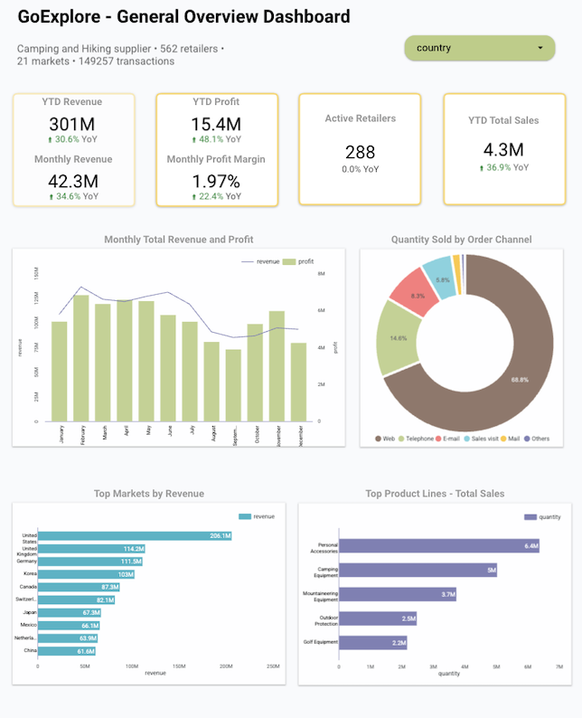
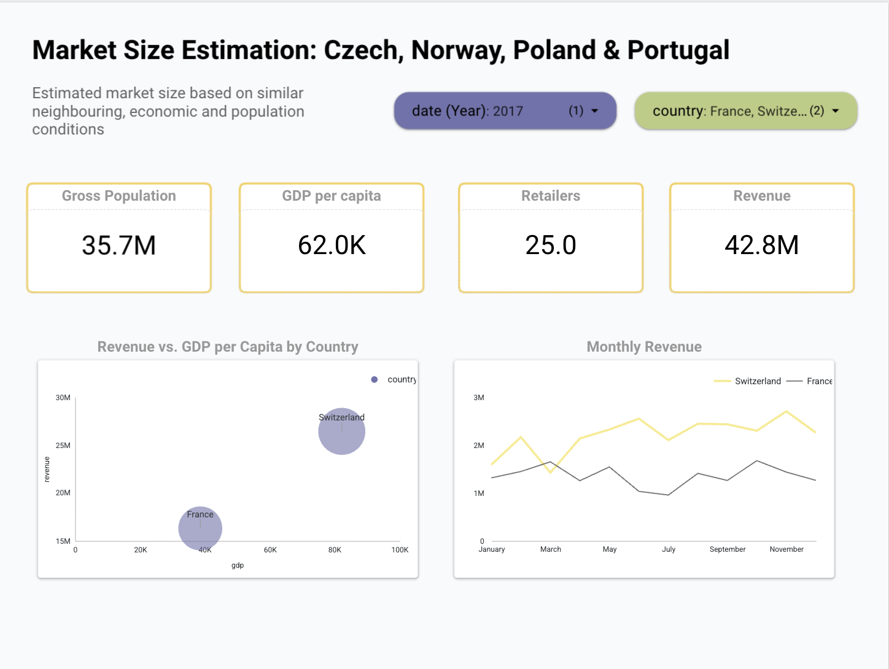
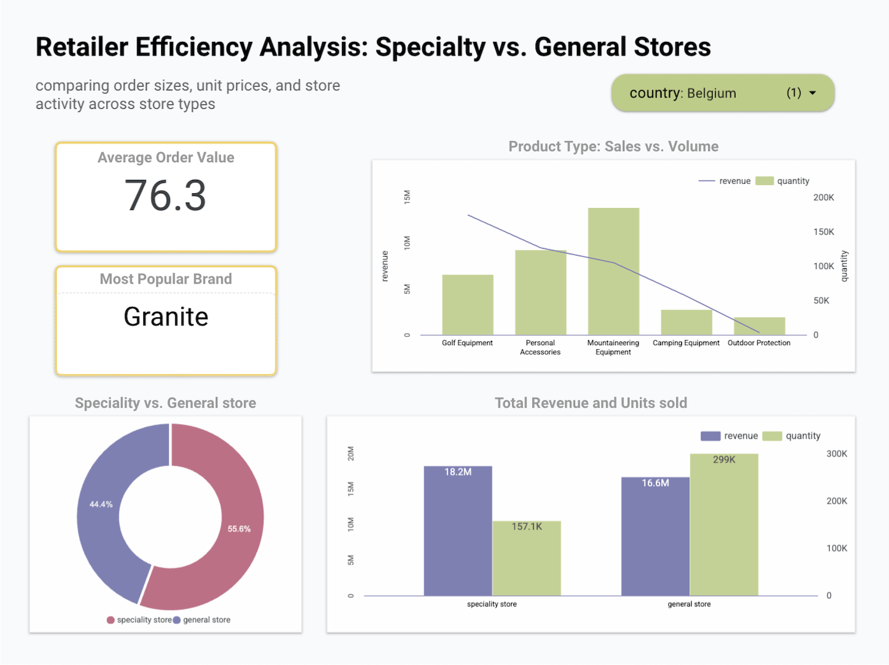

# GoExplore-Market-Analysis-Dashboard

## 📊 Project Overview 
This project analyzes market opportunities and retailer performance for GoExplore, with the goal of supporting expansion into four target countries:
- Czech Republic
- Norway
- Poland
- Portugal

The analysis focuses on two main business questions:
1. Market Expansion: What market size can GoExplore expect in the target countries based on comparisons with existing markets of similar population and GDP?
2. Retailer Performance: Do specialty retailers, such as Golf Shops and Eyewear Stores, perform differently from general retailers, such as Sports Stores and Outdoors Shops?

## 📈 Dashboard
The final interactive Dashboard consists of three pages: 

1. Overall Performance
Provides an overview of business performance using KPIs for revenue, profit, profit margin, sales and retailers, along with charts for monthly revenue, top markets, product lines and sales channels.

  

2. Market Size Estimation
Evaluates potential markets using population, GDP, GDP per capita, retailers and revenue. Country and year filters allow market comparisons, including revenue vs. GDP per capita and monthly revenue by country.

  

3. Retailer Efficiency
Compares specialty and general retailers using Average Order Value, sales, quantity sold, revenue and brand performance. A country filter allows retailer performance to be analyzed across markets.

  

## 🛠️ Tools Used
- Google Sheets – Data preparation and initial analysis
- BigQuery – Data storage, transformation and SQL analysis
- SQL – Data preparation and calculations
- Looker Studio – Interactive dashboard and data visualization
- External Data - Population, GDP and GDP per capita used for market comparison

## 🧠 Key Skills Demonstrated
Data Cleaning · SQL · BigQuery · Google Sheets · Looker Studio · Data Visualization · KPI Development · Market Analysis · Business Intelligence
